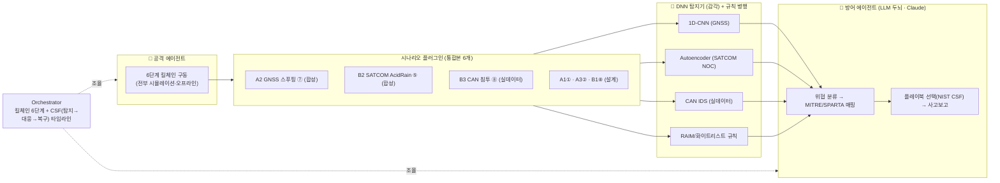

# DAH 2026 예선 — 구현 & 보고서 계획서 (PLAN v2 · 통합본 기준)

> 작성 기준일: 2026-07-08 · 기준 문서: **DAH2026_서베이_통합본.md** (반현준·형유림·임다은·김태형 4인 통합, 8계층·시나리오 6개)
> 시스템 코드네임(가칭): **SENTINEL** · 담당(구현 드라이브): 형유림
> 이 문서 하나로 (A) 코드 구현 + (B) 보고서 작성을 함께 관리한다.

---

## 0. 제약·목표 (움직일 수 없는 사실)

| 항목 | 값 |
| --- | --- |
| 보고서 제출 마감 | **2026-07-10(금) 23:59 KST** (오늘 7/8 → 실질 ~2.5일) |
| 부가자료(소스코드+실행매뉴얼) | **필수** — 외부 클라우드 다운로드 링크 |
| 보고서 형식 | PDF, 본문 25~40p 권장, 한국어(영문 혼용 가능) |
| 파일명 | `DAH2026_예선보고서_[팀명].pdf` / `DAH2026_소스코드_[팀명].zip` |

**채점 배점(100)** — 코드가 직결되는 항목 굵게:

| # | 항목 | 배점 | 이 프로젝트의 기여 |
| --- | --- | --- | --- |
| ① | 공격 시나리오 설계 | **30** | 통합본 6개 시나리오 → 그중 3개를 *실행되는* 킬체인으로 구현 |
| ② | 방어 전략 | **25** | 계층별 DNN 탐지기 + NIST CSF 대응 플레이북 + 정량지표 |
| ③ | AI 에이전트 아키텍처 | **25** | 6개를 관통하는 **멀티에이전트 프레임워크**(LLM 두뇌 + DNN 감각) 프로토타입 |
| ④ | 팀 역량 | 10 | 보고서 서술(코드 무관) |
| ⑤ | 문서 완성도 | 10 | README·재현성·출처·참고문헌 형식 |

> 핵심 관점: **보고서(PDF)가 채점 대상, 코드는 이를 뒷받침하는 부가자료.** 코드가 만드는 다이어그램·지표·로그·스크린샷이 보고서 §4/§5/§6에 그대로 들어간다.

---

## 1. 핵심 설계 결정

1. **"6개 전부를 관통하는 하나의 프레임워크"** 를 만든다 — 시나리오 6개를 제각각 구현하는 게 아니라, 통합본의 *공통 6단계 킬체인 + 공통 NIST CSF 방어 프레임*을 코드로 미러링. 각 시나리오는 **플러그인**(환경/데이터 + 탐지기 + 플레이북)으로 꽂힌다.
2. **대표 3개를 깊게 실증**(돌아가는 탐지 + 지표), 나머지 3개는 "같은 프레임워크 확장"으로 설계 서술.
   - **A2 GNSS 스푸핑(⑦)** — 시계열 센서융합, **합성**
   - **B2 SATCOM AcidRain(⑤)** — NOC 트래픽 이상탐지, **합성**
   - **B3 CAN 침투(⑧)** — CAN IDS, **실 공개 데이터셋**(Car-Hacking/OTIDS) → 신뢰도↑
   - (설계만) A1 RC①, A3 MAVLink②, B1 ROS2⑧
3. **DNN + LLM 하이브리드(둘 다).** DNN=감각(탐지, ②의 정량지표) / LLM(Claude)=두뇌(이질적 경보 통합·위협분류·플레이북 매칭·사고보고, ③). **LLM 에이전트가 DNN 탐지기를 tool로 호출.**
4. **데이터**: 합성(GNSS·SATCOM) + 실데이터(CAN). GNSS 원시 IQ(TEXBAT)+GNSS-SDR 빌드는 2일 불가 → 합성. CAN은 CSV 실데이터라 하루 내 처리 가능.
5. **층별(layered) 빌드 — 각 층이 그 자체로 제출 가능.** 중간에 끊겨도 완성물이 남게.
6. **폴백으로 마감 리스크 제거.** LLM 키 없으면 규칙기반 오프라인 완주 / GPU 안 되면 CPU / CAN 실데이터 다운로드 막히면 합성 CAN 생성기.

**빌드 우선순위(끊어도 각각 제출 가능):**

| 순서 | 산출물 | 확신도 |
| --- | --- | --- |
| ① A2 GNSS end-to-end | 점진 스푸핑 탐지 + TPR/FPR/탐지지연 + 그래프 | 높음 |
| ② B2 SATCOM end-to-end | NOC 이상탐지(오토인코더) + 지표 + 그래프 | 높음 |
| ③ B3 CAN end-to-end | 실데이터 CAN IDS + F1/혼동행렬 | 중~높음(데이터 확보 의존) |
| ④ 에이전트 프레임워크(규칙기반) | 공격→탐지→대응 루프 + 킬체인/CSF 타임라인 | 높음 |
| ⑤ LLM 업그레이드(Claude) | 위협분류·플레이북 매칭·사고보고를 실제 LLM으로 | 중(키 필요, 작업량 적음) |
| (설계만) A1·A3·B1 | 프레임워크 확장 지점 문서화 | — |

---

## 2. 시스템 아키텍처 — SENTINEL



**에이전트 역할(통합본 킬체인·방어와 매핑):**

| 에이전트 | 진영 | 역할 | 통합본 근거 |
| --- | --- | --- | --- |
| Recon | 🔴 | 대상 신호/인프라 식별 | Part 4 §8 |
| Attacker | 🔴 | 6단계 킬체인 구동(시나리오별) *전부 시뮬레이션·오프라인* | Part 7 각 *-1 |
| Detector | 🔵 | 계층별 DNN 탐지기 + 규칙 호출·해석, 경보 발령 | Part 5 §11, Part 6, 각 *-2 |
| Responder | 🔵 | 위협 분류(Part 3) → 플레이북 선택(Part 5) → 사고보고 | Part 5 §12·13, 각 *-3 |
| Orchestrator | — | 루프 실행·킬체인/CSF 타임라인 기록 | Part 7 |

> ⚖️ **법적·윤리 경계**: 모든 "공격"은 합성 시뮬레이터/공개 데이터셋 내부에서만. 실제 RF 송신·실장비 공격 없음(통합본 Part 4 법적 고지·차폐환경 전제 준수).

---

## 3. 레포 구조 (부가자료 권장 구성 준수)

```
dev/
├── README.md              # 실행법·의존성·환경변수·데모(★심사자가 봄)
├── requirements.txt
├── Dockerfile             # (옵션)
├── .gitignore             # .env, .venv, data/, models/, __pycache__
├── .env.example
├── PLAN.md                # 이 문서
├── config.yaml            # 시나리오·모델·에이전트 파라미터
├── src/
│   ├── scenarios/         # 플러그인 레지스트리(공통 인터페이스)
│   │   ├── base.py        # Scenario = {환경/데이터, 탐지기, 플레이북, 킬체인}
│   │   ├── a2_gnss.py  b2_satcom.py  b3_can.py     # 구현 3개
│   │   └── stubs.py       # a1_rc / a3_mavlink / b1_ros2 설계 스텁
│   ├── sim/
│   │   ├── gnss_sim.py    # A2: GNSS 관측치(C/N0·AGC·INS잔차·DOP·클럭)
│   │   ├── satcom_sim.py  # B2: NOC 관리망 이벤트 로그
│   │   └── can_loader.py  # B3: Car-Hacking/OTIDS 로더(+합성 폴백)
│   ├── detect/
│   │   ├── gnss_cnn.py    # 1D-CNN
│   │   ├── satcom_ae.py   # Autoencoder(Kitsune식)
│   │   ├── can_ids.py     # CAN 1D-CNN/tree
│   │   ├── rules.py       # RAIM/임계/화이트리스트 베이스라인
│   │   └── train.py       # 학습→지표·그래프(공통)
│   ├── agents/
│   │   ├── base.py        # LLM 래퍼(Claude) + 규칙 폴백
│   │   ├── recon.py  attacker.py  detector.py  responder.py
│   │   └── orchestrator.py
│   ├── mapping.py         # MITRE ATT&CK / SPARTA / NIST CSF 매핑 테이블
│   ├── tools.py           # 에이전트용 tool(탐지기·시뮬레이터)
│   └── run_demo.py        # end-to-end 데모(시나리오 선택)
├── results/               # 보고서용 지표·그래프·로그(일부 커밋)
│   ├── figures/  └── logs/
└── docs/
    ├── architecture.md    # Mermaid 다이어그램
    └── demo.md            # 스크린샷·데모영상 링크
```

**기술 스택**: Python 3.12 / PyTorch(CUDA·CPU) / numpy·pandas·matplotlib·scikit-learn(지표·ROC) / anthropic SDK(Claude, 기본 `claude-haiku-4-5`·옵션 `claude-sonnet-5`) / rich(콘솔 데모). 오케스트레이션은 경량 커스텀 상태머신(버전 리스크↓, 다이어그램은 Mermaid 문서화).

### 3.1 결과물 저장 규약 (코드 ↔ 보고서 분리)
- **`dev/results/`** — 코드의 기본 출력(레포 내, 재현용). 제출 ZIP에 포함.
- **`dev_docu/`** — 별도 **보고서용 근거자료 수집함**(레포·ZIP 밖, Dropbox). 코드가 `--docs-dir` 옵션으로 이 경로를 받으면 **정제본**(지표표·그림·로그·메타)을 시나리오별 폴더에 자동 저장. 구조·규약은 `dev_docu/README.md` 참조.
- 각 학습·데모 실행마다 저장: `metrics.md`(붙여넣기용 표), `*.png`(ROC·혼동행렬·탐지지연 등 300DPI), `run_log.txt`, `run_meta.json`(시각·시드·데이터규모·하이퍼파라미터 → 출처·재현성 표기용).
- ⚠️ 제출 코드엔 절대경로를 박지 않는다(`--docs-dir`/env로 주입, 기본은 레포 상대경로).

---

## 4. 일정 (Day 1 코드 → Day 2 보고서)

### Day 1 — 코드 스프린트 (~12h)
| 블록 | 작업 | 산출 |
| --- | --- | --- |
| H0–1 | 스캐폴드·venv·의존성·.gitignore·config·scenario base | 실행 뼈대 |
| H1–3 | **A2 GNSS**: 시뮬레이터 + 1D-CNN + 지표/그래프 | A2 end-to-end ✅ |
| H3–5 | **B2 SATCOM**: NOC 시뮬레이터 + 오토인코더 + 지표/그래프 | B2 end-to-end ✅ |
| H5–7 | **B3 CAN**: 데이터 로더(실/합성) + CAN IDS + F1/혼동행렬 | B3 end-to-end ✅ |
| H7–10 | 에이전트 4종 + tool + Orchestrator + MITRE/SPARTA/CSF 매핑 | 공격→탐지→대응 루프 |
| H10–11 | LLM(Claude) 연결·프롬프트·시나리오 완주, 로그·스크린샷 | LLM 데모 + 보고서 자료 |
| H11–12 | README·아키텍처 다이어그램·figures 정리·ZIP 패키징 | 부가자료 완성 |

### Day 2 — 보고서 조립·마감 (§5 참조)
오전 §4/§5/§6 초안(통합본+코드 결과 주입) → 오후 팀 취합(§1/§2/§3/§7) → 저녁 PDF 변환·교정·분량 점검 → 제출.

> compute 밤샘 불필요(학습 분 단위). 시간은 빌드·글쓰기에 쓴다.

---

## 5. 보고서 작성 구상

### 5.1 큰 그림 — "통합본 서베이는 원료, 보고서는 완제품"
통합본은 8개 요건 섹션의 **소스 자료**. 보고서는 (a) 통합본을 요건 순서로 재구성 + (b) **구현 결과 주입**(§6) + (c) PDF 다듬기.

### 5.2 8개 요건 섹션 ↔ 소스 매핑
| 보고서 섹션 | 주 소스 | 상태·필요 |
| --- | --- | --- |
| 1. 표지 | 팀 정보 | ⚠️ **팀명·팀원·제출일 필요** |
| 2. 목차 | 자동 | 마지막 생성 |
| 3. 팀 구성·역할·전문성 (10점) | 팀원 정보 | ⚠️ **팀원별 전문분야·역할·경험/수상 필요**(4인 분담은 통합본에 있음) |
| 4. 공격 시나리오 (30점) | 통합본 Part 2·3 + Part 7 **6개 시나리오** + **코드 킬체인 실행(3개)** | 통합본 준비됨 |
| 5. 방어 아키텍처 (25점) | 통합본 Part 5 + **코드 탐지·대응·지표** | 준비됨 |
| 6. AI 에이전트 (25점) | **본 구현물**: 프레임워크 다이어그램·에이전트 역할·기술스택·프로토타입 지표(3개)·스크린샷 | 코드에서 생성 |
| 7. 결론·향후 | 통합본 Part 7 §18 | 준비됨 |
| 8. 참고문헌 | 통합본 부록 참고문헌(~60건) | ✅ 자산 |

> §4는 통합본 6개 시나리오를 전부 서술하되, 그중 3개는 **코드로 실증**했다고 §6과 연결. §6이 25점 핵심.

### 5.3 작성 형식·도구
- 본문은 **Markdown**으로(통합본과 일관, 버전관리) → 마지막에 PDF 변환.
- **PDF 변환(택1, Day 2)**: (권장) Pandoc + XeLaTeX + 보유 Pretendard/NanumSquare / (경량) MD→HTML(Pretendard CSS)→브라우저 인쇄 / (익숙) HWP·Word.
- 그림: 아키텍처=Mermaid PNG, 성능=matplotlib(ROC·혼동행렬·탐지지연).
- 완성도(10점) 체크: 8섹션 순서 / 모든 표·그림·코드 출처 / 참고문헌 형식 통일 / 목차·페이지.

### 5.4 역할 분담(제안)
- **형유림(+본 도구)**: §4의 A2/B2/B3 + §5 방어 + §6 AI 에이전트(코드) + §8 정리. → 내가 초안 드래프트 가능.
- **팀원**: A1(김태형)·A3/B1(반현준)·B3 UGV 상세(임다은) 시나리오 문구 검수, §1 표지·§3 팀역량·§7 결론 최종본.

---

## 6. 리스크 & 폴백
| 리스크 | 폴백 |
| --- | --- |
| Anthropic 키/네트워크 | 규칙기반 오케스트레이션으로 오프라인 완주(내장) |
| RTX 5070(Blackwell) PyTorch 미지원 | cu128/nightly → 안 되면 CPU(모델 작아 무방) |
| CAN 실데이터 다운로드/등록 제한 | 합성 CAN 생성기(주기 ID+인젝션)로 폴백 |
| GNSS 실데이터(TEXBAT) | 합성이 기본 경로 |
| 시간 부족 | 우선순위 ①→⑤로 끊음(각 단계 제출 가능) |
| PDF 조판 난항 | HTML 인쇄 또는 HWP/Word |

---

## 7. 지금 필요한 결정·입력
1. **[결정] 코드네임** — "SENTINEL" 그대로? 다른 이름?
2. **[입력] 팀 정보** — 팀명 / 팀원 목록 / 각자 전문분야·역할·관련경험(§1·§3·파일명). (역할 분담 골격은 통합본에 있음)
3. **[확인] CAN 데이터셋** — Car-Hacking(HCRL) 사용 OK? (등록 필요 시 시간 소요 → 합성 폴백 준비)
4. **[확인] 데모 영상** — ③ 입증에 unlisted 영상 넣을지(선택, 가점).
5. **[확인] 키 세팅** — 새 터미널에서 `("$env:ANTHROPIC_API_KEY").Length`가 100+ 인지.

> 위가 정해지면 바로 Day 1 스캐폴드(H0–1)부터 착수한다.
