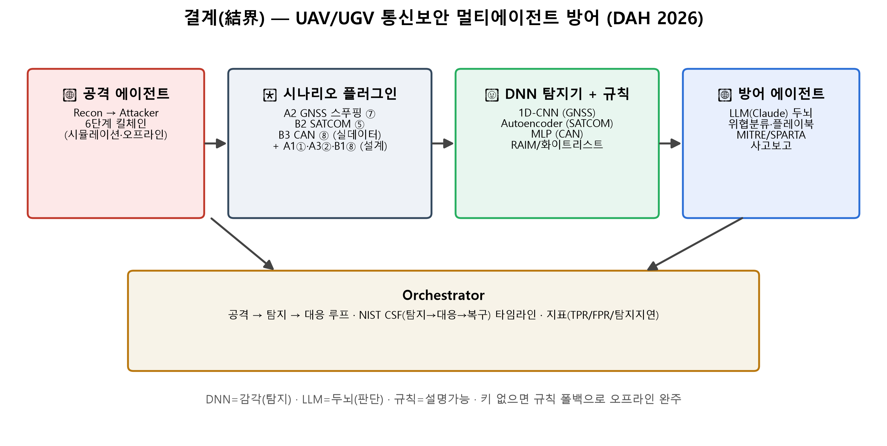

# 결계(結界) — UAV/UGV 통신보안 멀티에이전트 방어 (DAH 2026 · 팀 백공검)

> 통합본 서베이의 **6개 공격 시나리오를 관통하는 하나의 AI 방어 프레임워크**.
> 🔴공격 에이전트가 6단계 킬체인을 구동하면, 🧠**DNN 탐지기**(감각)가 이상을 잡고
> 🔵**LLM(Claude) 방어 에이전트**(두뇌)가 위협을 분류해 NIST CSF 플레이북으로 대응한다.



## 1. 핵심 요약
- **DNN = 감각(탐지), LLM = 두뇌(판단)** — LLM 에이전트가 학습된 DNN 탐지기를 *도구(tool)*로 호출.
- **대표 3개 시나리오를 실행 가능하게 구현**(서로 다른 계층 + 실데이터 로더), 나머지 3개는 동일 프레임워크 확장으로 설계.
- **규칙(RAIM·화이트리스트) 병행** → 설명가능. **키 없으면 규칙 폴백**으로 오프라인 완주.

| 시나리오 | 계층 | 공격 | 탐지기 | 데이터 |
| --- | --- | --- | --- | --- |
| **A2** | ⑦ PNT | GNSS 스푸핑(점진 표류) | 1D-CNN(다특징 시계열) | 합성 |
| **B2** | ⑤ 위성 | SATCOM 관리망·모뎀 침해(AcidRain형) | 오토인코더(비지도) | 합성 |
| **B3** | ④⑧ 내부버스 | Wi-Fi→CAN 인젝션 | 경량 MLP | 합성(실 Car-Hacking 로더 포함) |
| (설계) | ①②⑧ | RC Takeover / MAVLink CVE / ROS2 | 스펙트로그램CNN·LSTM·GNN | — |

## 2. 작동 원리 (How it works)

### 2.1 전체 데이터 흐름
```
🔴 공격 에이전트 ─▶ 시나리오 시뮬레이터 ─▶ 🧠 DNN 탐지기 + 규칙 ─▶ 🔵 LLM 방어 에이전트 ─▶ NIST CSF 플레이북
   (6단계 킬체인)     (합성 신호/트래픽)      (이상 점수 + 근거)      (위협분류·플레이북 선택)   (대응→복구→예방)
```
각 시나리오는 **플러그인**이다. 공통 인터페이스 `attack(rng)` / `load()` / `detect(bundle, atk)` 만 구현하면
오케스트레이터가 그대로 루프에 꽂는다(`src/scenarios/`). 그래서 시나리오를 추가해도 에이전트 코드는 그대로다.

### 2.2 🧠 DNN 탐지기 — 감각 (`src/detect/`)
| 계층 | 모델 | 입력 특징 | 출력 | 탐지 원리 |
| --- | --- | --- | --- | --- |
| ⑦ GNSS | **1D-CNN** | C/N0·C/N0산포·AGC·INS잔차·DOP·클럭점프·위성수 (7특징 × 20초 윈도) | 정상/스푸핑/재밍 | 스푸핑은 *급변이 아니라 점진 표류*라, INS 잔차가 서서히 커지는 시계열 패턴을 포착 |
| ⑤ SATCOM | **오토인코더**(비지도) | NOC 관리망 8특징(명령률·엔트로피·펌웨어푸시·모뎀팬아웃·인증실패·오프라인…) | 재구성오차(이상점수) | *정상만 학습* → AcidRain형 대량 배포는 재구성오차가 임계 초과 → 라벨 없이 신규 공격 포착 |
| ⑧ CAN | **경량 MLP** | CAN 윈도 8특징(IAT 통계·ID 엔트로피·미등록ID비율·단일ID점유…) | 정상/DoS/퍼지/스푸핑 | 주입 프레임이 IAT·ID 분포를 흔드는 통계적 이상을 분류 |

**규칙 병행(설명가능, `rules.py`)**: RAIM 잔차 임계 / 펌웨어푸시·오프라인 임계 / CAN ID 화이트리스트로
"왜 이상인지"를 사람이 읽는 근거로 제시 → DNN 점수와 함께 보고.

### 2.3 🔵 에이전트 — 두뇌 (`src/agents/`)
| 에이전트 | 역할 |
| --- | --- |
| **Recon** | 대상 신호/인프라 식별 |
| **Attacker** | 6단계 킬체인 구동 — *전부 시뮬레이션·오프라인* |
| **Detector** | DNN 탐지기를 **tool로 호출** → 경보(위협·점수·탐지지연·증거·규칙근거). LLM이 위협분석 서술 |
| **Responder** | 위협 분류 → MITRE ATT&CK/SPARTA 매핑 → NIST CSF 플레이북(대응/복구/예방) 선택 → 사고보고. LLM이 지휘요약 |
| **Orchestrator** | 공격→탐지→대응 루프 실행·타임라인 기록 |

**LLM 래퍼(`base.py`)**: `ANTHROPIC_API_KEY` 있으면 Claude 구동, 없으면 규칙 폴백.
**판정(위협분류·대응)은 결정적**(DNN+규칙 기반)으로 유지해 지표가 재현되고, LLM은 *자연어 서술*(위협분석·지휘요약)만 담당한다 → 키 유무와 무관하게 데모가 완주.

### 2.4 시나리오별 핵심
| | 공격 메커니즘 | 탐지 신호 | 대표 대응 |
| --- | --- | --- | --- |
| **A2** | 진짜 GPS에 동기 후 전력 우위로 락온 인계, 급변 없이 *서서히* 위치를 끌고 감 | INS 잔차 점진 확대 + C/N0 비정상 균일 + AGC 하강 | GNSS 차단→INS 단독 항법, OSNMA/CRPA |
| **B2** | 오설정 VPN으로 관리망 진입 → *정상으로 보이는* 관리명령으로 다수 모뎀에 와이퍼 일괄 배포 | 대량 펌웨어 푸시 + 모뎀 팬아웃 + 동시 오프라인 | 관리채널 격리, LOS/셀룰러 멀티링크 절체, 모뎀 Secure Boot |
| **B3** | Wi-Fi 침투 후 내부 CAN 버스에 DoS/퍼지/스푸핑 프레임 주입 | 미등록 ID·단일 ID 과점유·초저 IAT | 안전모드 정지, 세그먼트 격리, CAN MAC |

## 3. 결과 대시보드
터미널 로그 대신 **한 화면에 정리된 HTML 대시보드**(아키텍처·3개 시나리오 공격→탐지→대응·지표 그래프·플레이북):
```powershell
.\.venv\Scripts\python.exe src\make_report.py     # → docs/dashboard.html (브라우저로 열기)
```
자체 완결형(그림 base64 임베드)이라 파일 하나만 열면 되고, 라이트/다크 테마 자동 대응.

## 4. 빠른 시작
```powershell
# 가상환경 + 의존성 (Python 3.12)
python -m venv .venv
.\.venv\Scripts\python.exe -m pip install -r requirements.txt

# (선택) 실제 Claude 구동 — 없으면 규칙 폴백으로 동작
setx ANTHROPIC_API_KEY "sk-ant-..."      # 새 터미널에서 적용

.\.venv\Scripts\python.exe src\train.py    --scenario all   # 1) 탐지기 학습 → 지표·그래프
.\.venv\Scripts\python.exe src\run_demo.py --scenario all   # 2) 공격→탐지→대응 데모
.\.venv\Scripts\python.exe src\make_report.py               # 3) 결과 대시보드(HTML)
```
> `--docs-dir "<경로>"` 를 주면 보고서용 근거자료(지표표·그림·사고보고)를 그 폴더에 추가 저장한다.

## 5. 대표 결과 (합성데이터 PoC · 시드 42)
| 시나리오 | 지표 |
| --- | --- |
| A2 GNSS | 정확도 0.98 · 공격탐지 AUC 0.99 · 스푸핑 탐지지연(중앙값) ~4초 |
| B2 SATCOM | 이상탐지 AUC 0.98 · F1 0.96 · 탐지지연 ~2버킷(모뎀 마비 전 조기 탐지) |
| B3 CAN | 정확도 ~0.99 · macro-F1 ~0.99 (CAN IDS 문헌값과 부합) |

> 값은 합성/통제 데이터 기준 PoC이며, 통합본이 인용한 문헌값(GNSS 스푸핑 F1≈0.97, CAN IDS F1≈0.99)과 정합. 실 데이터셋(TEXBAT/OAKBAT, Car-Hacking) 연동은 로더에 준비(향후과제).

## 6. 프로젝트 구조
```
dev/
├── README.md · requirements.txt · config.yaml · .env.example
├── src/
│   ├── train.py           # 탐지기 학습·평가(지표·그래프)
│   ├── run_demo.py        # 공격→탐지→대응 오케스트레이션 데모
│   ├── make_report.py     # 결과 대시보드(HTML) 생성
│   ├── make_diagram.py    # 아키텍처 다이어그램 생성
│   ├── mapping.py         # MITRE/SPARTA/NIST CSF·플레이북
│   ├── sim/               # 합성 시뮬레이터(gnss·satcom·can)
│   ├── detect/            # DNN 탐지기 + 규칙 베이스라인
│   ├── scenarios/         # 시나리오 플러그인 + 레지스트리
│   └── agents/            # recon·attacker·detector·responder·orchestrator + LLM 래퍼
├── results/               # 코드 기본 출력(지표·그림·로그·사고보고)
└── docs/                  # architecture.(md|png) · dashboard.html · demo.md
```

## 7. 환경변수
| 변수 | 용도 |
| --- | --- |
| `ANTHROPIC_API_KEY` | Claude 구동(없으면 규칙 폴백). SDK가 자동 인식 |
| `GYEOLGYE_DOCS_DIR` | 보고서 근거자료 저장 폴더(`--docs-dir` 대체) |

## 8. 재현성 · 폴백
- 모든 난수는 `config.yaml`의 `seed`(기본 42)로 고정 → 결과 재현 가능.
- **LLM 키 없음** → 규칙 기반으로 완주 · **GPU 없음** → CPU(모델 작아 무방) · **실데이터 없음** → 합성.

## 9. ⚖️ 법적·윤리 고지
본 프로젝트의 모든 "공격"은 **합성 시뮬레이터/공개 데이터셋 내부에서만** 수행되며,
**실제 RF 송신·실장비 공격은 없다**(통합본 Part 4 법적 고지·차폐환경 연구 전제 준수).
방어 설계·탐지 연구 목적에 한정한다.

## 10. 보고서 연계 (DAH 예선)
- **§4 공격 시나리오** ← 킬체인 실행 + 통합본 6개 시나리오
- **§5 방어** ← DNN 탐지 지표(TPR/FPR/탐지지연) + NIST CSF 플레이북
- **§6 AI 에이전트** ← 본 프레임워크(다이어그램·에이전트 역할·프로토타입 결과·대시보드)

## 11. 향후과제
실 데이터셋 연동(TEXBAT/OAKBAT·Car-Hacking), 설계 스텁 3종(RC①·MAVLink②·ROS2⑧) 구현,
LLM 에이전트의 tool-calling 정식화(Claude tool use), 온라인 스트리밍 탐지.
