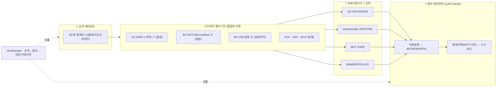

# 결계(結界) 아키텍처

## 개념
통합본 서베이의 **6개 시나리오를 관통하는 하나의 멀티에이전트 방어 프레임워크**.
각 시나리오는 *플러그인*(공격 시뮬레이터 + DNN 탐지기 + 대응 플레이북)으로 꽂힌다.
**DNN = 감각(탐지)**, **LLM(Claude) = 두뇌(판단·오케스트레이션)** — LLM 에이전트가 DNN 탐지기를 tool로 호출한다.

## 구성요소 ↔ 코드
| 구성요소 | 역할 | 코드 |
| --- | --- | --- |
| 공격 에이전트 | 6단계 킬체인 구동(시뮬레이션) | `src/agents/attacker.py` |
| 시나리오 플러그인 | 환경/탐지기/플레이북 캡슐화 | `src/scenarios/` |
| DNN 탐지기 | 1D-CNN·오토인코더·MLP | `src/detect/` |
| 규칙 베이스라인 | RAIM/화이트리스트(설명가능) | `src/detect/rules.py` |
| 방어 에이전트 | 탐지 해석·플레이북·사고보고 | `src/agents/detector.py`·`responder.py` |
| LLM 래퍼 | Claude 구동 + 규칙 폴백 | `src/agents/base.py` |
| Orchestrator | 루프·타임라인 | `src/agents/orchestrator.py` |
| 프레임워크 매핑 | MITRE/SPARTA/CSF·플레이북 | `src/mapping.py` |
